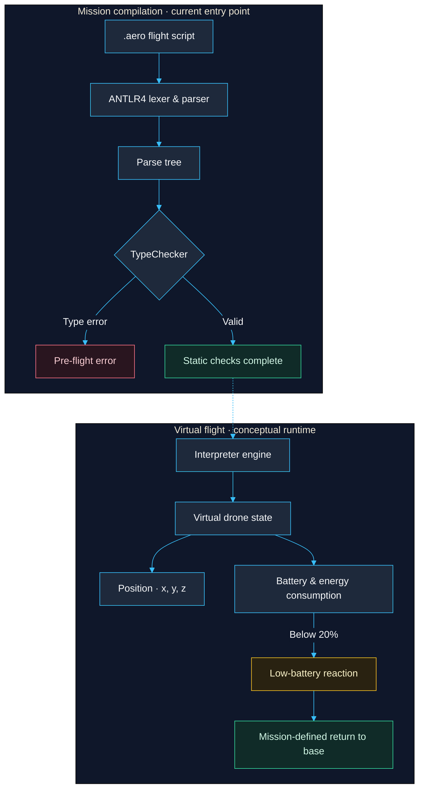

# AeroScript

<p align="center"></p>


**AeroScript is a dedicated Domain-Specific Language (DSL) for autonomous drone navigation.** It bridges human-readable mission scripts with a flight execution engine that can reason about spatial movement, reactive events, battery state, and safety fallbacks before a mission ever reaches the propellers.

Written in Java and powered by ANTLR4, AeroScript turns a compact `.aero` program into a checked, executable model of a drone mission. The result is a language designed for the interesting part of autonomous flight: real-time reactive behavior constrained by verifiable safety rules.

## Why AeroScript

### Spatial flight and maneuvers

Mission authors can express flight intent directly:

- Route through 2D coordinates with `move to point (x, y)`.
- Make precise relative shifts with `move by <dist>`.
- Change heading dynamically with `turn <dir> <angle>`.
- Climb or descend with `ascend by <num>` and `descend to ground`.
- Add execution controls such as speed and duration where the mission requires them.

### Battery and safety safeguards

The runtime keeps battery state alongside the drone’s position and execution state. Flight actions consume energy, the engine detects the low-battery threshold below 20%, and a mission can switch to a fallback routine such as automated docking or an emergency landing. Safety is part of the language model, not an afterthought in application code.

### Event-driven reactive missions

Named `Reaction` paths let a mission respond while it is running. A script can listen for:

- `MESSAGE` events, such as a launch or abort instruction.
- `OBSTACLE` events detected during navigation.
- `BATTERY` events raised when energy becomes critically low.

This makes it possible to describe a mission as a set of safe, composable behaviors instead of one brittle sequence of commands.

### Interactive drone control (REPL)

The interactive control surface supports live, step-by-step piloting: issue a command, inspect the resulting state, and evaluate the next action immediately. It is useful for mission exploration, instant diagnostics, and validating reactive behavior before committing a complete script.

## Compilation and runtime pipeline



The solid compilation path reflects the current application entry point; the dashed connection shows the conceptual flight runtime.

1. **Frontend:** ANTLR4 tokenizes the source and parses it into a Parse Tree from the `.aero` grammar.
2. **AST generation:** A custom visitor transforms parse-tree nodes into domain and expression AST nodes representing mission intent.
3. **Static type safety:** `TypeChecker` validates argument types ahead of flight. For example, invalid movement parameters can be rejected before a drone attempts to move.
4. **Virtual flight engine:** The runtime executes a heap-managed state machine with coordinate tracking, battery monitoring, execution frames, and call-stack transitions between mission blocks.

## Example mission

The following mission takes off, scans two waypoints, reacts to an obstacle, and returns to base when battery safety is triggered:

```aeroscript
// A low-battery reaction routes the drone into the return-to-base routine.
-> SurveyMission {
	on message [launch] -> TakeOff

	TakeOff {
		ascend by 20
	} -> SurveyNorth

	SurveyNorth {
		move to point (50, 50) at speed 10
		on obstacle -> EmergencyLanding
		on low battery -> ReturnToBase
	} -> SurveyEast

	SurveyEast {
		move to point (100, 50) at speed 10
		on obstacle -> EmergencyLanding
		on low battery -> ReturnToBase
	} -> ReturnToBase

	ReturnToBase {
		return to base
	}

	EmergencyLanding {
		descend to ground
	}
}
```

### Live Flight Execution & Telemetry Log

Illustrative output for a separate `patrol_alpha.aero` mission; this is a runtime interface concept, not output emitted by the current CLI.

```text
┌── [AEROSCRIPT TELEMETRY ENGINE v1.0] ──────────────────────────────────────────────┐
│ STATUS: ACTIVE MISSION       ALTITUDE: 50.0m       BATTERY: [██████░░░░] 58%       │
│ TARGET: POINT (10.0, 20.0)    HEADING: 090° EAST    MODE: AUTONOMOUS ROUTE         │
└────────────────────────────────────────────────────────────────────────────────────┘

[00:01.02] [PARSER]       Loaded mission: patrol_alpha.aero
[00:01.05] [TYPECHECK]    Static safety check: PASSED (0 TypeErrors)
[00:01.12] [TAKEOFF]      Ascending by 50.0m ... Altitude lock reached.
[00:02.40] [NAVIGATION]   Moving to point (10.0, 20.0) | Energy drain: -4.2%
[00:04.18] [SAFETY]       Battery threshold scan: OK (Above 20% limit)
[00:06.00] [ACTION]       Maneuver complete. Loitering at destination...
```

The `->` transitions connect named execution blocks, while reactions remain attached to the flight behavior that needs to handle them. This keeps the mission readable as both a program and a safety plan.

## Project structure

```text
src/main/antlr/       AeroScript grammar
src/main/java/        Lexer/parser integration, AST, type system, and runtime
src/test/java/         JUnit 5 tests
src/test/resources/   Example `.aero` programs and runtime fixtures
docs/                  Academic reports on the project milestones
```

## Build and run

The repository includes a Gradle wrapper, so no global Gradle installation is required.

Build the project:

```bash
./gradlew build
```

On Windows:

```bat
gradlew.bat build
```

Run the test suite with JUnit 5:

```bash
./gradlew test
```

```bat
gradlew.bat test
```

Run a mission file through the application entry point:

```bash
./gradlew run --args="src/test/resources/program.aero"
```

```bat
gradlew.bat run --args="src/test/resources/program.aero"
```

The Gradle build also produces an executable fat JAR with the `no.uio.aeroscript.Main` entry point:

```bash
./gradlew shadowJar
java -jar build/libs/aeroscript-1.0-all.jar src/test/resources/program.aero
```

## Design milestones

The `docs/` directory contains the three academic reports that document AeroScript's iterative architectural development:

- **AST:** parsing source into a domain-oriented abstract syntax tree.
- **Actions and REPL:** connecting the language model to executable actions and interactive control.
- **Type checking:** adding static validation so malformed missions are caught before runtime.

Together, the reports show how AeroScript grew from a grammar into a small, safety-aware flight programming environment.
