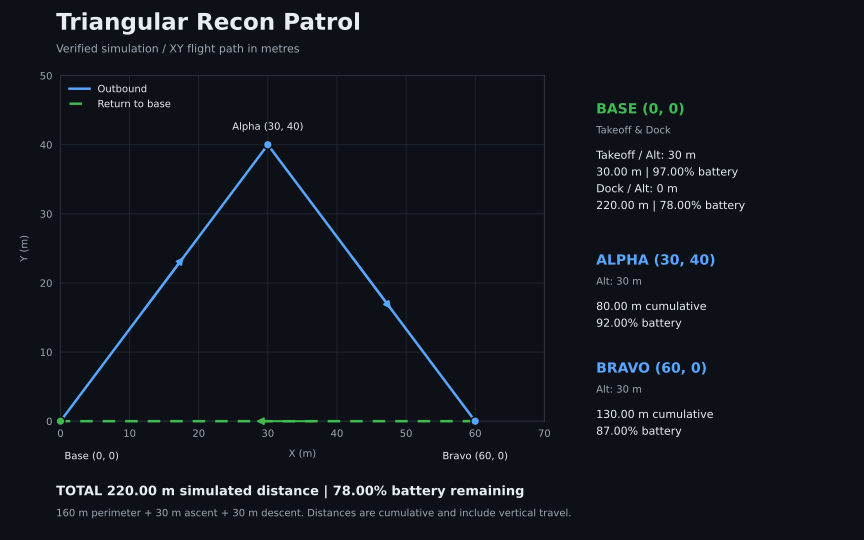

# AeroScript

AeroScript is an academic domain-specific language for drone missions, written in Java with ANTLR4 and Gradle. The project explores parsing, expression ASTs, static checking, and a documented interpreter design with stateful actions and event-driven safety reactions.

## Architecture and implementation status

```text
.aero source -> ANTLR4 lexer -> token stream -> ANTLR4 parser
                                               v
                                           parse tree
                                               v
                                TypeChecker + expression ASTs
                                               v
                                  sequential flight simulator
                                               v
                                      telemetry and summary
```

The [entry point](src/main/java/no/uio/aeroscript/Main.java) parses a file and checks argument types before starting the simulation. Parse, type, file, and execution errors produce a diagnostic on stderr and a nonzero exit status.

| Mechanism | Current source | Reported design |
| --- | --- | --- |
| Parsing and AST | [AeroScript.g4](src/main/antlr/AeroScript.g4) generates the ANTLR lexer, parser, and visitor. `Expressions` builds typed expression ASTs using `NumberNode` and `OperationNode`. | A visitor builds domain and expression ASTs for the full interpreter. |
| Static checking | [TypeChecker](src/main/java/no/uio/aeroscript/runtime/TypeChecker.java) validates numeric and point operands, including point/range components and speed/duration types. | Action arguments are checked before runtime. |
| Flight actions | [FlightRuntime](src/main/java/no/uio/aeroscript/runtime/FlightRuntime.java) simulates ascent, movement, turns, descent, and docking directly from action parser contexts. | Separate `acAscend`, `acMove`, `acTurn`, and `acDock` classes update shared heap state. |
| Battery failsafe | The simulator rejects an action before execution if its projected battery level would fall below 20%. | `Utilities.checkBattery` dispatches a `BATTERY` event to a registered reaction, or terminates when no trigger is present. |

The simulator supports one sequential mission block. It rejects reactions, nested blocks, transitions, and speed/duration modifiers before any flight action runs. Those constructs remain part of the grammar and documented interpreter design; the event-driven `program.aero` fixture is not executable by this simulator.

Simulation starts at `(0, 0)` on the ground with 100% battery and heading along positive x. Left turns increase the heading. Travel consumes **0.1 battery percentage points per metre**, using horizontal distance plus vertical distance; turns consume no energy. Docking returns horizontally to the origin and descends to ground. This is a demonstration model, not a physical drone energy model.

## Action and reaction mechanics

The [second project report](docs/Rapport_oblig2.docx) describes the interpreter's action classes:

| Action class | Language form | Documented responsibility |
| --- | --- | --- |
| `acAscend` | `ascend by 20` | Increase altitude, calculate energy use, update heap state, and check battery status. |
| `acMove` | `move to point (50, 50)` or `move by 10` | Resolve a destination or relative distance, update position, and account for energy use. |
| `acTurn` | `turn right by 90` | Process direction and angle, update runtime state, and check battery status. |
| `acDock` | `return to base` | Return to the initial position and update altitude, distance, and battery state. |

In that design, `Execution` manages normal statements and an emergency stack. `Reaction` handles `MESSAGE`, `OBSTACLE`, and `BATTERY` events. Below 20% battery, execution prioritizes the emergency stack. The mission's reaction target determines whether the fallback lands or returns to base; docking is not an unconditional automatic response.

## Triangular Recon Patrol

[examples/recon_patrol.aero](examples/recon_patrol.aero) ascends to 30 m, visits Alpha `(30, 40)` and Bravo `(60, 0)`, then returns to Base and lands. The mission passes static checking and completes with **220.00 m** simulated distance and **78.00%** battery remaining.



The XY perimeter is 160 m. The simulator also counts 30 m of ascent and 30 m of descent. Node statistics show cumulative distance and remaining battery; Base includes both takeoff and docking states.

<table>
<thead><tr><th>Mission source</th><th>Actual terminal output</th></tr></thead>
<tbody><tr>
<td valign="top"><pre><code>-&gt; TriangularReconPatrol {
    ascend by 30
    move to point (30, 40)
    move to point (60, 0)
    return to base
}</code></pre></td>
<td valign="top"><pre><code>[TYPECHECK] Passed
[MISSION] TriangularReconPatrol (simulation)
[ASCEND] position=(0.0, 0.0) | altitude=30.0 m | battery=97.00%
[MOVE] position=(30.0, 40.0) | altitude=30.0 m | battery=92.00%
[MOVE] position=(60.0, 0.0) | altitude=30.0 m | battery=87.00%
[DOCK] position=(0.0, 0.0) | altitude=0.0 m | battery=78.00%
[SUMMARY] Mission complete | actions=4 | position=(0.0, 0.0) | altitude=0.0 m | distance=220.00 m | battery=78.00%</code></pre></td>
</tr></tbody>
</table>

Captured by running:

```bash
java -jar build/libs/aeroscript-1.0-all.jar examples/recon_patrol.aero
```

The smaller [demo_flight.aero](examples/demo_flight.aero) remains available as an introductory mission. To regenerate the plot from verified simulator output, run `python scripts/plot_recon.py` after building the JAR; the plotting script requires Matplotlib.

## Build, test, and run

The repository includes a Gradle wrapper. From the repository root:

| Task | macOS / Linux | Windows PowerShell |
| --- | --- | --- |
| Build | `./gradlew build` | `.\gradlew.bat build` |
| Run the patrol | `./gradlew run --args="examples/recon_patrol.aero"` | `.\gradlew.bat run --args="examples/recon_patrol.aero"` |
| Build executable JAR | `./gradlew shadowJar` | `.\gradlew.bat shadowJar` |
| Run configured tests | `./gradlew test` | `.\gradlew.bat test` |

Run the executable JAR with:

```bash
java -jar build/libs/aeroscript-1.0-all.jar examples/recon_patrol.aero
```

The JUnit 5 suite in `src/test/java/` runs `examples/demo_flight.aero` and verifies its final state and energy use. It also covers argument type errors, expression evaluation, turns, the battery guard, invalid input, and unsupported control flow. The older `TypeCheckerTest.java` under `src/test/resources/runtime/` remains an uncompiled assignment fixture.

## Project structure

```text
src/main/antlr/       Language grammar
src/main/java/        Entry point, expression AST, type checker, and simulator
examples/            Runnable demo and triangular patrol missions
src/test/java/       JUnit 5 integration tests
src/test/resources/  Original mission and assignment test source
docs/                Project reports and verified flight-path plot
scripts/             Telemetry plot generator
```

## Project reports

- [Assignment 1: expressions and AST](docs/IN2031%20Oblig%201%20Rapport.pdf)
- [Assignment 2: actions, interpreter, reactions, and REPL](docs/Rapport_oblig2.docx)
- [Assignment 3: type checking](docs/Oblig3_rapport.pdf)

The reports record the project's development across assignments. Runtime and REPL behavior described there should be read alongside the implementation status above when exploring this checkout.
